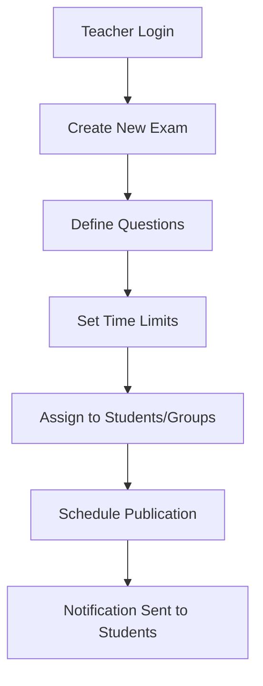
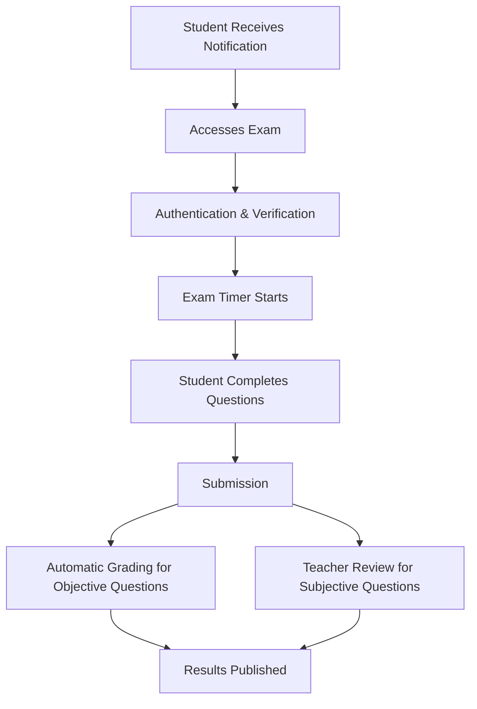

# 📊 Hell-App System Overview

This document provides a visual overview of the Hell-App student examination system, including screenshots of key
interfaces, workflow diagrams, and feature demonstrations.

  

## 📱 User Interfaces

### Authentication Screens

|                Login Screen                 |                    Registration Screen                    |
|:-------------------------------------------:|:---------------------------------------------------------:|
|  |  |

*The authentication system uses JWT with HTTP-Only cookies for secure sessions.*

### Student Dashboard

The student dashboard provides:

- Overview of upcoming and past examinations
- Current progress and grades
- Notifications for new exams and results
- Quick access to study materials

### Teacher Interface

|                 Exam Creation                 |                  Grade Management                   |
|:---------------------------------------------:|:---------------------------------------------------:|
|  |  |

Teachers can:

- Create and modify examinations
- Set time limits and access conditions
- Grade submissions with detailed feedback
- View statistics on student performance

### Administrator Panel

Administrators have access to:

- User management
- System configuration
- Statistics and reporting
- Log and audit trails

## 🔄 Key Workflows

### Exam Creation Process

### Examination Flow

## 💡 Feature Highlights

### Responsive Design

The application is fully responsive, working seamlessly on desktop, tablet, and mobile devices:

|                      Desktop                      |                     Tablet                      |                     Mobile                      |
|:-------------------------------------------------:|:-----------------------------------------------:|:-----------------------------------------------:|
|  |  |  |

### Time Zone Handling

The system automatically adjusts examination times based on the student's local time zone, ensuring that students in
different geographical locations all have the same amount of time for examinations.

### Real-time Notifications

Users receive real-time notifications about:

- New exam assignments
- Upcoming examination deadlines
- Grade publications
- System announcements

## 🔒 Security Features

- **Role-Based Access Control**: Content and actions are strictly limited based on user roles
- **JWT Authentication**: Secure token-based authentication with HTTP-Only cookies
- **Audit Logging**: All critical actions are logged for security review
- **Data Encryption**: Sensitive information is encrypted both in transit and at rest

## 📈 Performance Metrics

| Page           | Load Time | API Response Time |
|----------------|-----------|-------------------|
| Dashboard      | < 1.2s    | < 200ms           |
| Exam Interface | < 1.5s    | < 250ms           |
| Results View   | < 1.0s    | < 150ms           |

*Measured on standard broadband connection (50Mbps) with the production configuration.*

---

> Note: This overview document is regularly updated as new features are added to the system. Screenshots shown are from
> the latest stable release.
